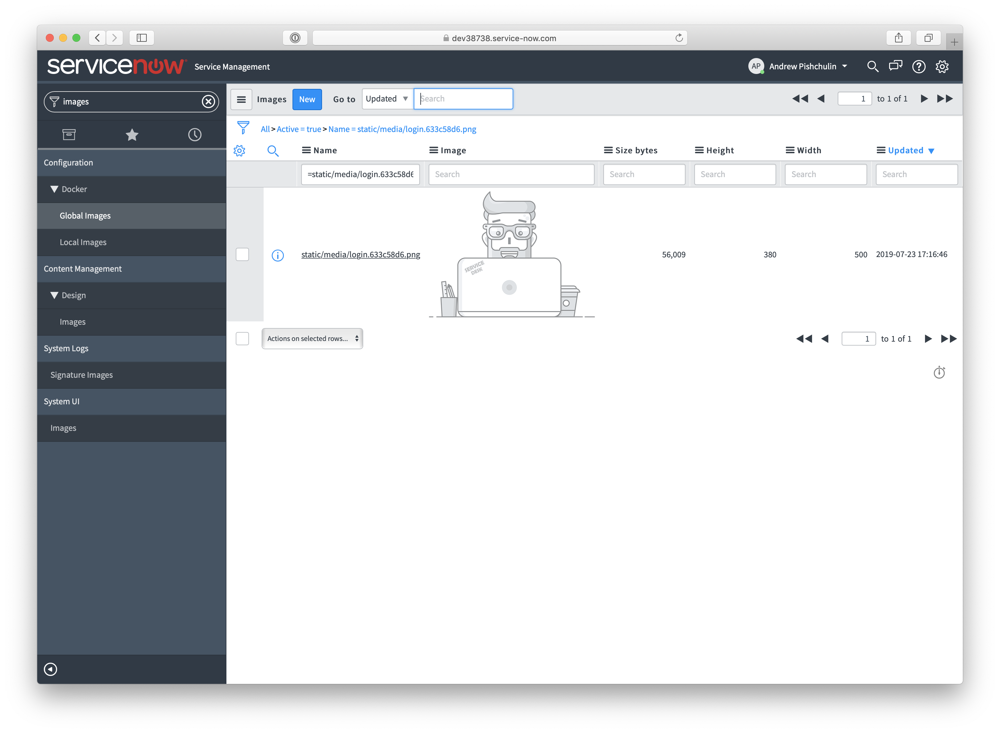
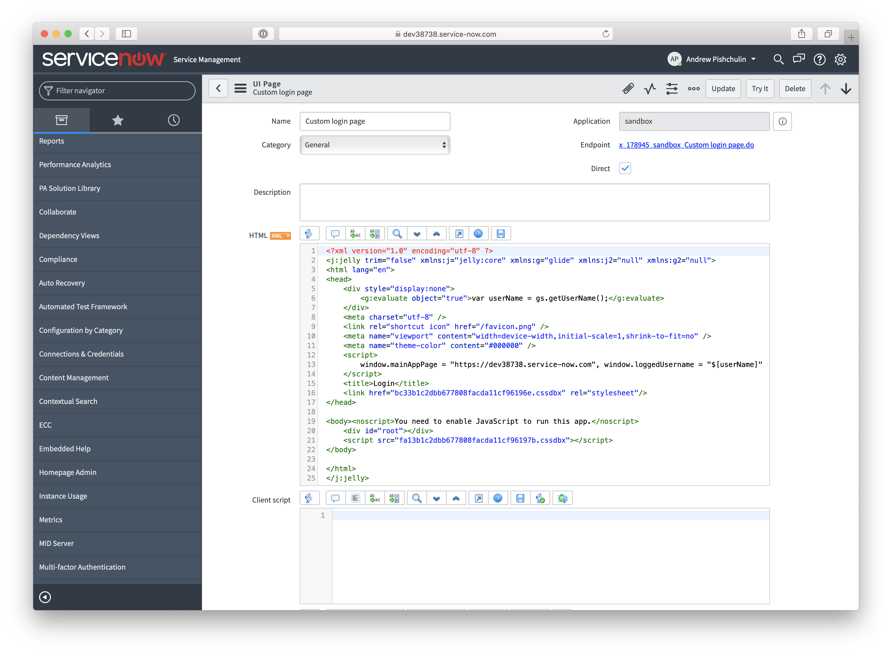
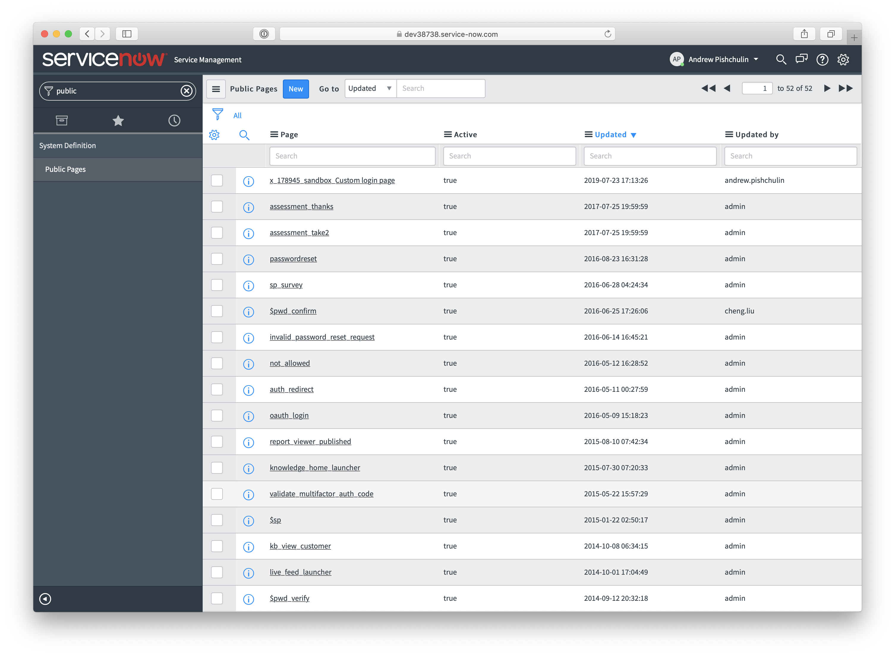

# Login page for ServiceNow applications and portals

Custom login page built with React. 

It provides out-of-the-box ServiceNow login functionality, including `remember me` option.

Login page implemented as a simple React application and can be used as a gateway for any ServiceNow application and portal.

## How to test/run locally
1. Copy/clone the repo
2. Install all dependencies by `npm i`
3. Run the app by `npm start`

> IMPORTANT: You won't be able to test login process locally, since the app should be run _inside_ of ServiceNow instance. However, you can customize HTML/CSS markup etc. 

## How to deploy to ServiceNow
1. Build the application by `npm run build`.
2. Save JS and CSS files from Build/static folder as Style Sheets in ServiceNow.
3. Upload logo image from Build/static/media folder to ServiceNow: go to System UI/Images and create a new image with a name `static/media/login.633c58d6.png`:

4. Create a _direct_ UI page and copy HTML code from the file 'Build/index.html`. You also need to do the following steps:
    - update `window.mainAppPage` with the URL where you want to redirect in case of successfull login
    - update `window.loggedUsername` with this specific code `$[userName]`
    - update css and js references with the corresponding sys_ids from step #2

You UI page should look like this:

5. Make UI page public:
    - activate Public Pages module under System Definition menu
    - create a new record for you UI page

6. Your login page should be publicly available by the URL provided on the UI page record.

## Contacts
Questions, requests for customization or development services - support@dev-labs.io
